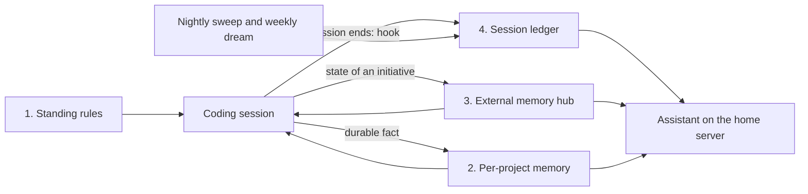

# agent-files

How two coding agents share one memory.

Claude Code and Codex CLI are used interchangeably here, on more than one machine, and neither is allowed to own the memory. Everything an agent should remember lives in plain markdown files under git, in four layers. Both agents read and write the same files, a nightly job distills every session into a ledger, and an assistant on a home server reads the ledgers to answer "what was I working on." This repository holds the rules, the tooling, and the templates. The memory content itself is private and lives elsewhere.

## The four layers

| Layer | What it holds | Who writes it | Who reads it | In this repo |
| --- | --- | --- | --- | --- |
| 1. Standing rules | How work should be done: shell habits, writing rules, verification rules, and the rituals for the other three layers | You. The "twice rule": the second time you correct the same thing, the agent writes it here in the same turn | Both agents, at the start of every session | `CLAUDE.md`, `AGENTS.md`, `codex/` |
| 2. Per-project memory | One fact per file plus an index, keyed by the repository a session runs in: who you are, corrections with their reasons, ongoing constraints, pointers to external resources | The agent, when it learns something the repo and git history do not record | The same agent next session in that project. Both tools resolve the same directory | `bin/agent-memory-dir` |
| 3. External memory hub | The current state of every live initiative: an always-read `INDEX.md`, one spoke file per workstream, a credential pointer registry, a dated log | The agent at session end, following a ritual in the hub's own `CLAUDE.md` | The agent at session start; the assistant on a timer | `external-memory/` |
| 4. Session ledger | What happened in each session: outcome, artifacts, open threads, and the command to resume it | Automatic: a SessionEnd hook, a nightly sweep, a weekly consolidation | You ("where was that conversation"), the assistant for recaps | `session-ledger/` |

Layers 1, 2 and 4 are per machine. Layer 3 is a git repository of its own, one per identity (personal work and employer work never share a hub), so it travels between machines and the assistant can clone it read-only.

## How a fact travels



1. A session learns something durable. The agent saves it as a per-project memory, or, if it is the state of an initiative, appends a dated line to the hub spoke.
2. The session ends. A hook hands the transcript to `session-ledger`, which writes a four-line entry to the ledger within seconds. A nightly sweep catches sessions the hook missed. A weekly pass merges related entries and lists facts worth promoting to memory.
3. File sync carries the memory directories and ledgers to the home server; the hubs arrive through GitHub on a timer.
4. The assistant reads layers 2 through 4. It never sees a transcript; the ledger entry is all it knows about a session.

Only one step needs discipline: the append at the end of a session that changed an initiative's state. Everything else is automatic or happens on the way in.

## Design choices, and why

- **Markdown in git, never a database.** The agent reads the whole hub every session, so the format must be readable in one pass and diffable when the agent edits it. If search outgrows `rg`, derive a disposable index; the files stay the source of truth.
- **Line caps enforced by a git hook.** Unbounded memory becomes unread memory. A hub's `INDEX.md` is capped at 150 lines and each spoke at 100; when a cap hits, the agent prunes resolved state before adding anything. The caps are what keep the memory curated instead of accreted.
- **Pointers, never secrets.** The hub's `ACCESS.md` records which env var, profile, or vault item holds a credential. The linter rejects token shapes before a commit and again in the commit message.
- **A vocabulary blocklist per hub.** Some content belongs somewhere else on purpose (candid notes about people, anything a synced clone must never carry). The hub names the words that mark it and the hook refuses the commit.
- **One memory, two tools.** Codex's native memory feature stays off and Claude's per-project directory is canonical, so switching tools loses nothing and there is one thing to maintain.
- **The ledger never loses a resume line.** The weekly consolidation is model-written; if the model drops an entry, the original is restored verbatim and the pass still lands.
- **Failures page you.** Every scheduled piece sends a Pushover alert when it fails, with the source in the title. A memory system that silently stops writing is worse than none.

## What is in this repository

- `session-ledger/`: the hook, the sweep, the weekly dream pass, the installer, and the tests. Portable: machine-specific values live in an untracked env file.
- `external-memory/`: the hub pattern with a scaffold script, a generic lint, git hooks, and templates for `CLAUDE.md`, `INDEX.md`, `ACCESS.md`, `LOG.md`, and an initiative spoke.
- `codex/`: the memory section shared into Codex's `AGENTS.md`, so Codex follows the same chain Claude does.
- `bin/agent-memory-dir`: resolves the per-project memory directory both agents share.
- `CLAUDE.md`, `AGENTS.md`, `settings.json`, `statusline.py`, `skills/`: the standing rules and tooling as installed.

## Adopt it

```bash
git clone git@github.com:ericpardee/agent-files.git ~/Development/github.com/ericpardee/agent-files
cd ~/Development/github.com/ericpardee/agent-files

# layer 4: the ledger (hook, nightly sweep, weekly dream)
session-ledger/install.sh ~/path/to/ledger.md

# layer 3: a private hub for your own initiatives
external-memory/scaffold.sh ~/path/to/my-memory "My"
```

Then point your global `CLAUDE.md` and `AGENTS.md` at the hub with the snippet in `external-memory/README.md`, and let the per-project memory (layer 2) fill itself.

## What stays private on purpose

The hubs, the ledgers, the per-project memory directories, and any candid notes about people never appear in this repository. What you see here is the shape of the system; the content is the point of keeping it.

## Links

- [Claude Code Local Docs](https://github.com/ericbuess/claude-code-docs)
- [Solatis Agents based off Southbridge Research's analysis of Claude Code prompts](https://github.com/solatis/claude-config)
