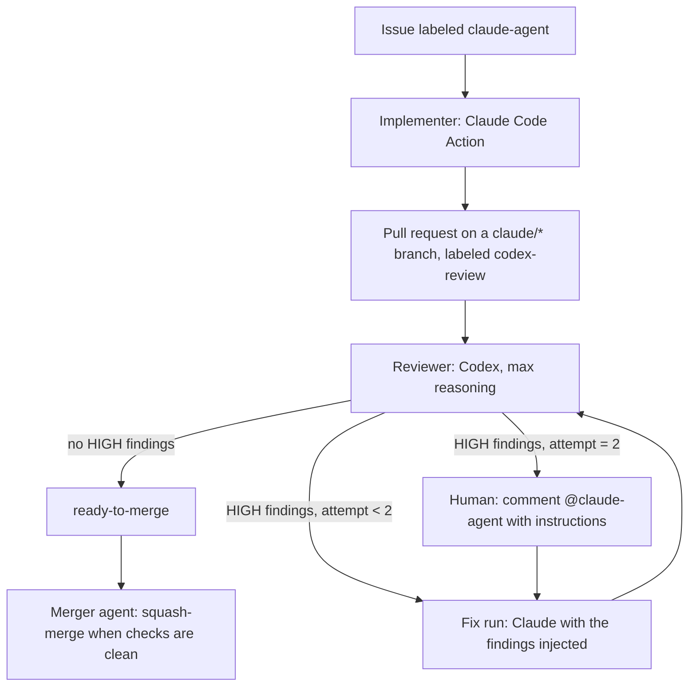

# An issue-to-merge pipeline run by two models

A design note. A GitHub issue goes in; a reviewed, merged pull request comes out; a human is involved only when the loop cannot converge. One model writes the code, a different model reviews it, and plain GitHub Actions plumbing enforces the rules between them. This ran for months on a private project; the note keeps the design and the lessons, not the YAML, as it drifts.

## The loop

Three workflows, three roles:

| Role | Trigger | Output |
| --- | --- | --- |
| Implementer | Issue labeled `claude-agent`, or an `@claude-agent` comment | A branch, a PR that references the issue, the `codex-review` label |
| Reviewer | PR opened from a `claude/*` branch, or dispatched after a fix | Findings as JSON with a severity per item; labels `needs-fixes` or `ready-to-merge`; a comment with the review |
| Merger | The `ready-to-merge` label, or a schedule | A squash merge, or a `merge-conflict` label and a comment |

Two models on purpose. A model reviewing its own output tends to agree with itself; a second model with a different training lineage catches a different class of mistakes, and the disagreement is where the value is.

## Guardrails

- **Bounded retries.** The reviewer counts `fix-attempt-N` labels on the PR. After two fix attempts that still produce HIGH findings, it stops dispatching and asks for a human. A human comment resets the counter, so a person can hand the loop new instructions and let it run again.
- **Severity contract.** The reviewer returns structured JSON: HIGH blocks the merge and triggers a fix, MEDIUM is recorded for a human's judgment, LOW is informational. The contract is what lets a script, not a model, decide what happens next.
- **Parse failure blocks the merge.** If the reviewer's output cannot be parsed, the PR gets `codex-parse-failed` and never `ready-to-merge`. Silence is not approval.
- **Strict merge state.** The merger merges only a PR whose mergeable state is `clean`: every check passed, no conflicts, up to date with the base. Anything else gets a label and a comment for a person.
- **Actor gating.** Only an OWNER, MEMBER, or COLLABORATOR can trigger the implementer. A stranger's comment does nothing.
- **No secrets in GitHub.** Every job assumes an AWS role through OIDC and reads the model API keys from Secrets Manager at run time. There are no long-lived credentials in repository secrets, and rotating a key means changing one place.
- **Shell-injection hygiene.** Model output reaches shell steps only through environment variables, never interpolated into a command line.
- **Hard time caps.** Every job has a 15-minute timeout and the implementer has a turn cap, so a runaway loop costs minutes, not hours.

## Lessons

- **`GITHUB_TOKEN` does not trigger workflows.** A comment or push made with the default token never fires another workflow, by design, to prevent recursion. So the reviewer cannot hand off to the implementer by leaving a comment. It dispatches the fix run explicitly with `workflow_dispatch` (PR number, issue number, attempt count, and the findings as inputs), which works with the default token because it is a direct call rather than an event.
- **Dispatch from the default branch.** A `workflow_dispatch` runs the workflow file on the ref you name. Dispatch against the default branch so the file that runs is the one that has the trigger, not whatever the PR branch happens to contain.
- **Fix mode wanted the CLI, not the action.** The hosted action was fine for implementing an issue from scratch but did not reliably apply edits to an existing PR. Fix runs invoke the CLI directly with the findings in the prompt and commit the result themselves.
- **Multiline arguments broke the action.** Passing a multiline prompt through a generic arguments parameter produced an unexplained exit 1. Use the action's dedicated inputs for prompt, model, and allowed tools.
- **Models fence their JSON.** The reviewer wrapped its JSON in a markdown code fence often enough that the parse step extracts the fenced block before parsing. Treat the fence as part of the format.
- **Workflow files need a stronger token.** The default token cannot push files under `.github/workflows/`. When an issue asks the implementer to create a workflow, it puts the content in the PR body and a person pushes it.
- **Review and merge race.** If the merger runs while the reviewer is still working, the PR has no labels yet and is skipped. A scheduled merger pass catches it later. Design the merger to be safe to run at any time rather than trying to sequence it perfectly.
- **Template literals with markdown inside JavaScript steps broke YAML.** Bold markers inside a template string tripped the YAML parser; string concatenation did not.

## Measuring it

A separate evaluation suite runs on pushes to the main branch and on demand, in three parts: it grades the implementer's output on real past issues, measures semantic search relevance against golden query-answer pairs, and compares transcription quality against ground truth. Twenty to fifty cases built from real failures were enough to notice regressions. The suite reads the same Secrets Manager entry through the same OIDC role, so it needs nothing the pipeline does not already have.

## What I would change

- **Make the reviewer's contract a schema.** Validate the JSON against a schema in the workflow and reject anything else, instead of relying on the model to keep the shape.
- **Diff-scoped review.** Review the diff against the merge base, not the whole tree, and pass the issue text alongside so the reviewer judges against intent as well as correctness.
- **Cost in the PR.** Post model spend per run on the PR so the economics of each merge are visible where the decision is made.
- **Turn the scheduled merger off by default.** The hourly pass was a workaround for the review-merge race; a label-triggered merger plus a manual dispatch covers it with fewer surprise merges.
